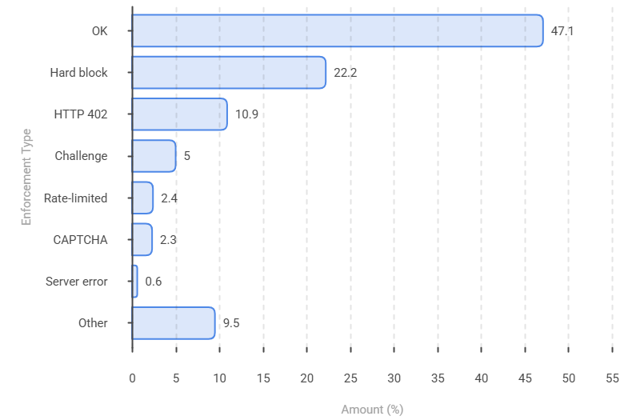
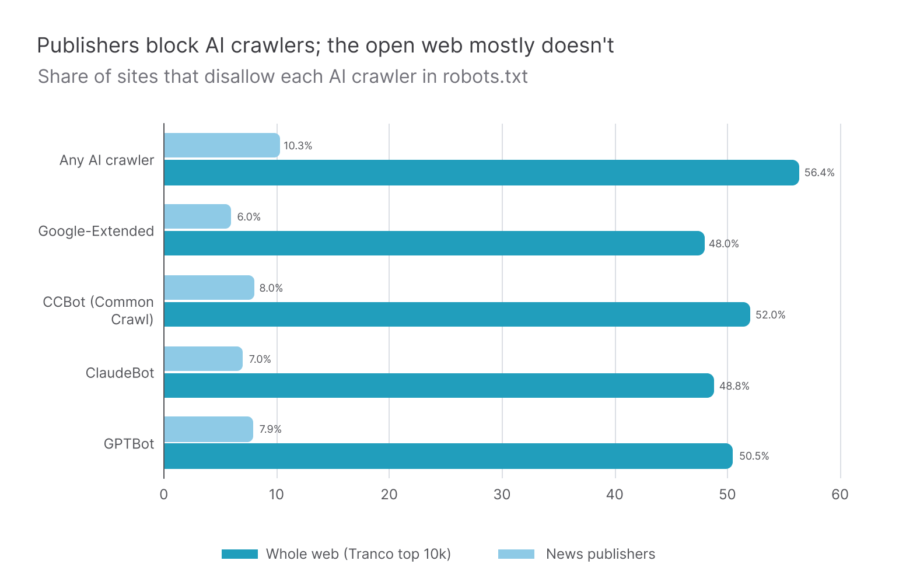
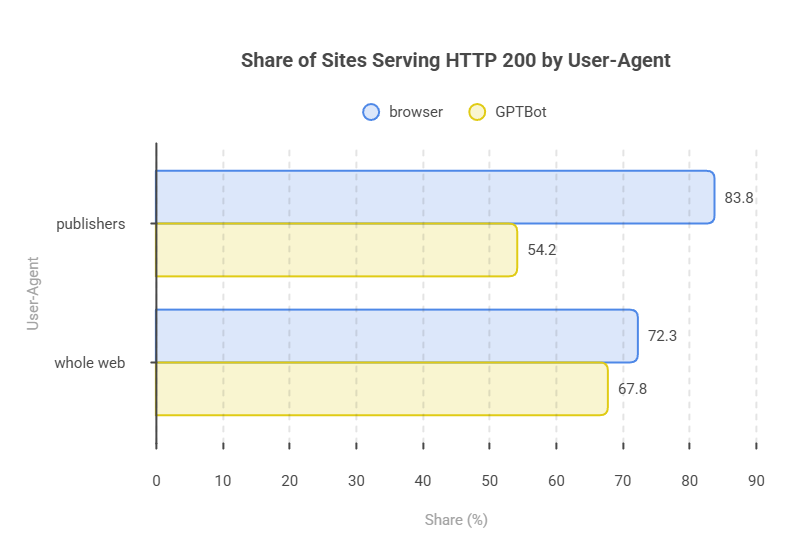
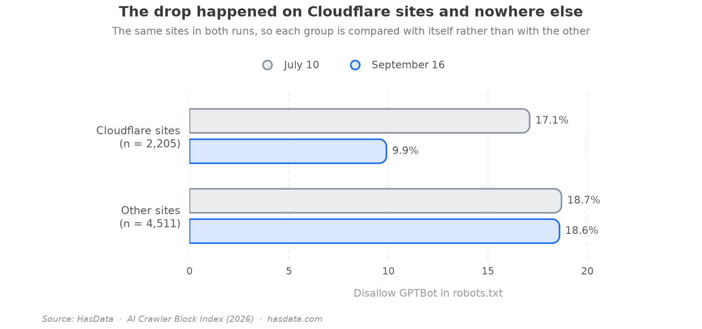

# The AI Crawler Block Index (Dataset)

[](https://doi.org/10.5281/zenodo.23101648)


Data behind [The AI Crawler Block Index](https://hasdata.com/blog/ai-crawler-block-index), a HasData study of how the top of the web blocks AI crawlers on paper and in practice. The panel covers 10,894 registrable domains, measured twice with the same method. The July 10, 2026 wave is the baseline taken before Cloudflare's default AI block took effect, and the September 16, 2026 wave is the first measurement after it. As far as we know, no other public dataset holds the before picture.

## Table of Contents

- [Key Findings](#key-findings)
- [The Panel](#the-panel)
- [Method](#method)
- [Files](#files)
- [File Schemas](#file-schemas)
- [Reproducing the Checks](#reproducing-the-checks)
- [Scope of This Release](#scope-of-this-release)
- [License](#license)
- [How to Cite](#how-to-cite)
- [Disclaimer](#disclaimer)
- [More Resources](#more-resources)

## Key Findings

39.5% of the sites that disallow `GPTBot` in `robots.txt` served it the page anyway when it knocked (234 of 592 cleanly tested sites in July). By September the share was 34.9%.



News publishers ban AI crawlers at 50.5% against 7.9% on the open web, a sixfold gap.



Identity alone costs a bot a third of the web. From the same datacenter IP, a browser user-agent got a page from 83.8% of publishers and `GPTBot` from 54.2%.



After September 15, written bans started to vanish rather than spread. On Cloudflare-proxied sites the `GPTBot` disallow rate fell from 17.1% to 9.9% between the waves, while non-Cloudflare sites stayed flat at 18.7% to 18.6%.



Two more numbers set the scale. Cloudflare's default AI block covered 8.5% of the open web and 13.6% of publishers on the eve of September 15, and blocking does not keep a site out of AI answers, since 27 of the 82 domains Google's AI Overview cited on our ten news queries block at least one AI crawler. The [article](https://hasdata.com/blog/ai-crawler-block-index) walks through all of it with the full chart set, and every number above traces to a row in the files below.

## The Panel

The sample is 9,746 domains from the Tranco top-10k list (list ID `46XLX`) plus 1,148 news publishers from the [news-homepages](https://github.com/palewire/news-homepages) project, 10,894 registrable domains in total. Policy statistics (Cloudflare presence, ads signature, `robots.txt` rules, `llms.txt`) cover the whole panel. The live enforcement test runs on a fixed 2,096-domain subset (the top 1,000 web domains plus all publishers) with a 600-domain residential sample on top.

## Method

Policy facts come from each domain's own responses. A site counts as behind Cloudflare when its homepage response carries a `cf-ray` or `server: cloudflare` header. It counts as carrying ads when it serves a valid `ads.txt` or its homepage shows an ad-tech signature. A bot counts as blocked in `robots.txt` only when its own user-agent group disallows the root, so a global `*: Disallow` doesn't count.

Enforcement is measured by requesting the homepage twice from the same US datacenter IP, once with a Chrome user-agent and once with the official `GPTBot` user-agent string. The GPTBot requests are spoofed, not sent from OpenAI's verified crawler, so the data can't show how Cloudflare treats verified bots. Archived `robots.txt` copies come from Common Crawl (`CC-MAIN-2026-30` for July, `CC-MAIN-2026-34` for August). Archive.org was unavailable on September 16 and is not used.

## Files

Everything lives in `data/`, one file per measurement, with dates in the names where a file belongs to one wave.

| File | Rows | What it holds |
|---|---|---|
| `data/headline_july_vs_sept.csv` | 57 | Every headline metric of the study, July 10 against September 16, by segment |
| `data/vanished_notice_118_domains.csv` | 118 | Domains whose archived `robots.txt` carried an AI-training signal, with the September 16 live state of each |
| `data/robots_refused_2026-09-16.csv` | 206 | Domains that refused to serve `robots.txt` to the pipeline on September 16, with retries from home and datacenter IPs. 125 of the 206 sit behind Cloudflare |
| `data/live_probes_2026-07-23.jsonl` | 1,500 | Raw homepage probes, 250 domains, 6 user-agents each, from one residential exit IP |
| `data/per_bot_penalty_2026-07-23.json` | | Per-user-agent outcome counts aggregated from the raw probes |
| `data/http_status_breakdown_2026-07-23.json` | | HTTP status distribution and per-CDN enforcement behaviour |
| `data/ai_overview_vs_blocking_2026-07-23.json` | | 10 news-shaped queries, the 82 domains Google's AI Overview cited, and whether each blocks AI crawlers |
| `data/verify_118_live_2026-09-17.json` | 118 | Independent one-day-later re-check of the 118 vanished-notice domains |

The headline CSV is the one to start with. It carries every number the study leads with, both waves side by side.

## File Schemas

`headline_july_vs_sept.csv` has five columns. `Segment` names the slice (open web, news publishers, or the whole panel), `Metric` names the measurement, the two date columns carry the July 10 and September 16 values, and `Change` is their difference in percentage points.

`vanished_notice_118_domains.csv` tracks each domain from its archived signal to its live state. The archive columns record which signal the Common Crawl copy carried (a `Content-Signal: ai-train=no` line, an EU Article 4 reservation, or a `GPTBot` disallow) with the capture date. The September 16 columns record the live `robots.txt` HTTP status, whether a Cloudflare managed block or Bot Preference Sync block is present, whether `GPTBot` is still disallowed, and the outcome of live GPTBot requests in July and September.

`robots_refused_2026-09-16.csv` lists each refusing domain with its segment, whether it sits behind Cloudflare, its July `robots.txt` status, the September 16 pipeline status, and retry outcomes from a home IP and a datacenter IP with a validity flag for each.

`live_probes_2026-07-23.jsonl` is one JSON object per probe with five keys. `domain` and `final_url` identify the request, `ua_label` is one of `browser`, `gptbot`, `claudebot`, `perplexitybot`, `ccbot`, `meta-externalagent`, `status` is the HTTP status code, and `class` is the outcome bucket (`ok`, `blocked`, `blocked-payment`, `challenge`, `ratelimited`, `error`, or an `other-*` status). Across the 1,500 probes the browser user-agent reached content 193 times out of 250 while `GPTBot` managed 111, and 303 probes ended at a payment wall.

`verify_118_live_2026-09-17.json` holds one object per domain with boolean flags. Of the 101 domains that answered with HTTP 200, one still carried an `ai-train=no` signal, two carried any Content-Signal, three an Article 4 reservation, six a `GPTBot` disallow, and none a Bot Preference Sync block.

`ai_overview_vs_blocking_2026-07-23.json` lists the ten queries, then splits the 82 cited domains into 27 that block at least one AI crawler in `robots.txt`, 25 that block none, and 30 outside the panel.

## Reproducing the Checks

The `method/` folder holds the scripts behind the verification files. `per_bot_penalty_probes.py` sends the six-user-agent probes and writes the raw JSONL, `http_status_breakdown.py` aggregates statuses and per-CDN behaviour, and `ai_overview_citations.py` collects AI Overview citations through the [HasData SERP API](https://hasdata.com/apis/google-serp-api) and joins them against the blocking data. The citations script reads the key from the `HASDATA_API_KEY` environment variable, and the scripts expect the fieldwork input files in `method/raw/`, which this release doesn't ship.

## Scope of This Release

This release ships every aggregate table of the study and all raw verification runs. The per-domain panel behind the policy statistics (one row per each of the 10,894 domains) is planned as a follow-up release. The panel definition above is exact, so the sample itself is reproducible from the public Tranco and news-homepages lists.

## License

The dataset is released under [CC BY 4.0](LICENSE). You can copy, share, and adapt it, including commercially, as long as you credit HasData with a link to [hasdata.com](https://hasdata.com) or the [study](https://hasdata.com/blog/ai-crawler-block-index).

## How to Cite

Every GitHub release of this repository is archived on Zenodo. The DOI below always resolves to the latest release, and each release also carries its own DOI on the [Zenodo record](https://doi.org/10.5281/zenodo.23101648) when a citation has to point at one exact version.

> HasData. (2026). *The AI Crawler Block Index (Dataset)* [Data set]. Zenodo. https://doi.org/10.5281/zenodo.23101648

```bibtex
@dataset{hasdata_ai_crawler_block_index,
  author    = {{HasData}},
  title     = {The AI Crawler Block Index (Dataset)},
  year      = {2026},
  publisher = {Zenodo},
  doi       = {10.5281/zenodo.23101648},
  url       = {https://doi.org/10.5281/zenodo.23101648}
}
```

GitHub's "Cite this repository" button in the sidebar gives the same reference in APA and BibTeX.

## Disclaimer

The data comes from publicly available `robots.txt` files and homepage responses, collected for research. Whether and how such collection is appropriate depends on jurisdiction, the site, and the use, and nothing in this repository is legal advice. [Is Web Scraping Legal?](https://hasdata.com/blog/is-web-scraping-legal) covers how we think about the question.

## More Resources

- [The AI Crawler Block Index](https://hasdata.com/blog/ai-crawler-block-index), the study this data belongs to
- [Web Scraping Without Getting Blocked](https://hasdata.com/blog/web-scraping-without-getting-blocked)
- [Cloudflare press release on the default AI block](https://www.cloudflare.com/en-gb/press/press-releases/2026/cloudflare-helps-end-the-search-or-ai-training-tradeoff/)
